# C4 Model Diagrams: ChatGPT ToDo App

## Overview

This document contains C4 Model diagrams for the ChatGPT ToDo App with AI Task Decomposition. The system implements a ChatGPT-integrated task management application using the OpenAI Apps SDK with MCP (Model Context Protocol).

---

## C1 - System Context Diagram

This diagram shows the ToDo App system in context, illustrating how it interacts with users and external systems.

```mermaid
flowchart TB
    subgraph legend[Legend]
        direction LR
        person[👤 Person]
        system[System]
        external[External System]
    end

    User["👤 User
    ―――――――――――
    A person who wants to
    manage tasks through
    natural conversation"]
    
    TodoSystem["📋 ChatGPT ToDo App
    ―――――――――――――――――
    Allows users to create, manage,
    and decompose tasks through
    conversational AI interface
    ―――――――――――――――――
    [Software System]"]
    
    ChatGPT["🤖 ChatGPT
    ―――――――――――
    Provides conversational AI
    interface and invokes MCP
    tools on behalf of users
    ―――――――――――
    [External System]"]

    User -->|"Sends natural language
    requests via chat"| ChatGPT
    ChatGPT -->|"Invokes tools via
    MCP Protocol"| TodoSystem
    ChatGPT -->|"Returns task confirmations
    and inline UI cards"| User

    style User fill:#08427B,color:#fff
    style TodoSystem fill:#1168BD,color:#fff
    style ChatGPT fill:#999999,color:#fff
    style legend fill:#fff,stroke:#ccc
```

**Description:** The System Context diagram shows that users interact with the ChatGPT ToDo App indirectly through ChatGPT. Users send natural language requests (like "Add task: Buy groceries") to ChatGPT, which translates these into MCP tool calls. The ToDo App processes these requests and returns both structured data (for ChatGPT's reasoning) and HTML inline cards (for user display).

**Design Decision:** ChatGPT acts as the primary interface, meaning users never interact with the ToDo App directly. This enables a fully conversational UX where task management feels like a natural chat.

---

## C2 - Container Diagram

This diagram shows the high-level technical building blocks of the system and how they communicate.

```mermaid
flowchart TB
    subgraph legend[Legend]
        direction LR
        cont[Container]
        db[(Database)]
        ext[External]
    end

    User["👤 User"]
    
    subgraph ChatGPTClient["ChatGPT Client"]
        WebApp["📱 Web/Mobile App
        ―――――――――――
        ChatGPT interface where
        users send messages
        ―――――――――――
        [Web Application]"]
    end

    subgraph TodoSystem["ChatGPT ToDo App"]
        MCPServer["🐍 MCP Server
        ―――――――――――――
        Handles MCP protocol,
        registers tools, processes
        tool invocations
        ―――――――――――――
        [Python: uvicorn + MCP SDK]"]
        
        SQLite[("💾 SQLite Database
        ―――――――――――
        Stores tasks with
        hierarchical subtask
        relationships
        ―――――――――――
        [SQLite: tasks.db]")]
    end

    User -->|"Uses"| WebApp
    WebApp -->|"MCP Protocol
    [Streamable HTTP]"| MCPServer
    MCPServer -->|"Reads/Writes
    [aiosqlite]"| SQLite
    MCPServer -->|"Returns JSON-RPC
    responses + HTML cards"| WebApp

    style User fill:#08427B,color:#fff
    style WebApp fill:#999999,color:#fff
    style MCPServer fill:#438DD5,color:#fff
    style SQLite fill:#438DD5,color:#fff
    style ChatGPTClient fill:#f5f5f5,stroke:#999
    style TodoSystem fill:#fff3e0,stroke:#ff9800
    style legend fill:#fff,stroke:#ccc
```

**Description:** The Container diagram reveals two main containers within the ToDo App boundary: the MCP Server (Python application) and SQLite Database. The MCP Server receives tool invocations from ChatGPT via Streamable HTTP transport, processes them asynchronously, and persists data to SQLite using the aiosqlite library for non-blocking database operations.

**Key Technical Choices:**
- **Streamable HTTP:** Chosen over stdio/SSE as recommended by Apps SDK; enables bidirectional streaming
- **SQLite:** Zero-configuration persistence ideal for single-user learning project
- **aiosqlite:** Enables async database operations without blocking the event loop

---

## C3 - Component Diagram: MCP Server

This diagram zooms into the MCP Server container to show its internal components and their responsibilities.

```mermaid
flowchart TB
    subgraph legend[Legend]
        direction LR
        comp[Component]
        ext[External]
    end

    ChatGPT["🤖 ChatGPT
    [External System]"]

    subgraph MCPServer["MCP Server Container"]
        direction TB
        
        ServerEntry["🚀 Server Entry Point
        ―――――――――――――――
        server.py
        ―――――――――――――――
        Initializes MCP server,
        registers tools, manages
        HTTP transport layer
        ―――――――――――――――
        [Python: mcp + uvicorn]"]
        
        ToolsLayer["🔧 Tools Layer
        ―――――――――――――――
        task_tools.py
        ―――――――――――――――
        Defines tool schemas,
        implements handlers,
        coordinates responses
        ―――――――――――――――
        [Python: Pydantic]"]
        
        DBLayer["💽 Database Layer
        ―――――――――――――――
        models.py
        ―――――――――――――――
        TaskRepository with CRUD
        operations, connection
        management, typed queries
        ―――――――――――――――
        [Python: aiosqlite]"]
        
        UIComponents["🎨 UI Components
        ―――――――――――――――
        components.py
        ―――――――――――――――
        Generates HTML for
        inline cards following
        Apps SDK UI guidelines
        ―――――――――――――――
        [Python: Pure functions]"]
    end

    SQLite[("💾 SQLite
    [Database]")]

    ChatGPT -->|"POST /mcp
    [list_tools, call_tool]"| ServerEntry
    ServerEntry -->|"Routes tool calls"| ToolsLayer
    ToolsLayer -->|"CRUD operations"| DBLayer
    ToolsLayer -->|"Requests card HTML"| UIComponents
    DBLayer -->|"SQL queries
    [parameterized]"| SQLite
    ServerEntry -->|"JSON-RPC response
    + UI resources"| ChatGPT

    style ChatGPT fill:#999999,color:#fff
    style ServerEntry fill:#85BBF0,color:#000
    style ToolsLayer fill:#85BBF0,color:#000
    style DBLayer fill:#85BBF0,color:#000
    style UIComponents fill:#85BBF0,color:#000
    style SQLite fill:#438DD5,color:#fff
    style MCPServer fill:#e3f2fd,stroke:#1976d2
    style legend fill:#fff,stroke:#ccc
```

**Description:** The Component diagram shows four distinct components within the MCP Server, following a layered architecture pattern. The Server Entry Point handles protocol concerns, the Tools Layer implements business logic for the five MCP tools (add_task, list_tasks, complete_task, delete_task, decompose_task), the Database Layer encapsulates SQLite operations, and UI Components generate HTML cards.

**Component Responsibilities:**

| Component | Primary Responsibility |
|-----------|----------------------|
| Server Entry Point | MCP protocol handling, tool registration, HTTP transport |
| Tools Layer | Tool schemas (Pydantic), business logic, input validation |
| Database Layer | TaskRepository with async CRUD, connection pooling |
| UI Components | HTML generation for inline cards (pure functions) |

---

## C3 - Component Diagram: Tools Layer Detail

This diagram provides additional detail on the Tools Layer, showing the individual tools and their interactions.

```mermaid
flowchart TB
    subgraph ToolsLayer["Tools Layer (task_tools.py)"]
        direction TB
        
        AddTask["➕ add_task
        ―――――――――
        Creates new task
        or subtask
        ―――――――――
        Input: title, parent_id?"]
        
        ListTasks["📋 list_tasks
        ―――――――――
        Retrieves tasks with
        optional filtering
        ―――――――――
        Input: filter?, parent_id?"]
        
        CompleteTask["✅ complete_task
        ―――――――――
        Marks task as
        completed
        ―――――――――
        Input: task_id"]
        
        DeleteTask["🗑️ delete_task
        ―――――――――
        Removes task and
        cascades to subtasks
        ―――――――――
        Input: task_id"]
        
        DecomposeTask["🔀 decompose_task
        ―――――――――
        Creates subtasks from
        ChatGPT-generated titles
        ―――――――――
        Input: task_id, subtask_titles[]"]
    end

    subgraph Schemas["Pydantic Schemas"]
        TaskBase["TaskBase
        title: str"]
        TaskCreate["TaskCreate
        parent_id?: int"]
        Task["Task
        id, completed,
        created_at, subtasks[]"]
    end

    DBLayer["Database Layer"]
    UIComp["UI Components"]

    AddTask --> DBLayer
    ListTasks --> DBLayer
    CompleteTask --> DBLayer
    DeleteTask --> DBLayer
    DecomposeTask --> DBLayer

    AddTask --> UIComp
    ListTasks --> UIComp
    CompleteTask --> UIComp
    DeleteTask --> UIComp
    DecomposeTask --> UIComp

    Schemas -.->|"validates"| AddTask
    Schemas -.->|"validates"| ListTasks
    Schemas -.->|"validates"| CompleteTask
    Schemas -.->|"validates"| DeleteTask
    Schemas -.->|"validates"| DecomposeTask

    style AddTask fill:#c8e6c9,color:#000
    style ListTasks fill:#bbdefb,color:#000
    style CompleteTask fill:#fff9c4,color:#000
    style DeleteTask fill:#ffcdd2,color:#000
    style DecomposeTask fill:#e1bee7,color:#000
    style TaskBase fill:#f5f5f5,color:#000
    style TaskCreate fill:#f5f5f5,color:#000
    style Task fill:#f5f5f5,color:#000
    style DBLayer fill:#85BBF0,color:#000
    style UIComp fill:#85BBF0,color:#000
    style ToolsLayer fill:#e8f5e9,stroke:#4caf50
    style Schemas fill:#fafafa,stroke:#9e9e9e
```

**Description:** This detailed view of the Tools Layer shows the five MCP tools exposed to ChatGPT. Each tool has a defined input schema (validated by Pydantic), interacts with both the Database Layer for persistence and UI Components for generating response cards. The decompose_task tool is unique in that ChatGPT generates the subtask titles externally—the tool only persists them.

**Design Decision:** Task decomposition leverages ChatGPT's reasoning rather than implementing AI in the MCP server. This keeps the server simple and takes advantage of the existing ChatGPT session context.

---

## Data Flow Diagram

This sequence diagram shows the complete flow for adding and decomposing a task.

```mermaid
sequenceDiagram
    participant U as 👤 User
    participant C as 🤖 ChatGPT
    participant S as 🐍 MCP Server
    participant D as 💾 SQLite

    Note over U,D: Adding a Task
    U->>C: "Add task: Plan birthday party"
    C->>S: call_tool(add_task, {title: "Plan birthday party"})
    S->>D: INSERT INTO tasks (title) VALUES (?)
    D-->>S: {id: 1, title: "Plan birthday party", ...}
    S-->>C: {task: {...}, ui: "<inline-card>..."}
    C-->>U: Display task confirmation card

    Note over U,D: Decomposing the Task
    U->>C: "Break this down into subtasks"
    Note right of C: ChatGPT reasons about subtasks
    C->>S: call_tool(decompose_task, {task_id: 1, subtask_titles: ["Choose venue", "Create guest list", "Order cake"]})
    S->>D: INSERT INTO tasks (title, parent_id) VALUES (?, 1) x3
    D-->>S: [{id: 2, ...}, {id: 3, ...}, {id: 4, ...}]
    S-->>C: {parent_task: {...}, subtasks: [...], ui: "<inline-card>..."}
    C-->>U: Display hierarchy card with subtasks
```

**Description:** This sequence diagram illustrates two key flows: basic task creation and AI-assisted decomposition. Note that in the decomposition flow, ChatGPT generates the subtask titles based on its understanding of the parent task—the MCP server simply persists whatever titles ChatGPT provides.

---

## Summary

| Diagram Level | Purpose | Key Insights |
|--------------|---------|--------------|
| C1 - Context | System boundaries and actors | Users interact indirectly via ChatGPT |
| C2 - Container | Technical building blocks | Python MCP Server + SQLite, Streamable HTTP |
| C3 - Component | Internal structure | Layered architecture with 4 components |
| C3 - Tools Detail | Tool breakdown | 5 MCP tools with Pydantic validation |

**Architecture Characteristics:**
- **Simplicity:** Layered architecture ideal for learning
- **Async-first:** uvicorn + aiosqlite for non-blocking I/O
- **Type-safe:** Pydantic schemas ensure validation and generate JSON Schema
- **Conversational UI:** Inline cards render within chat flow
