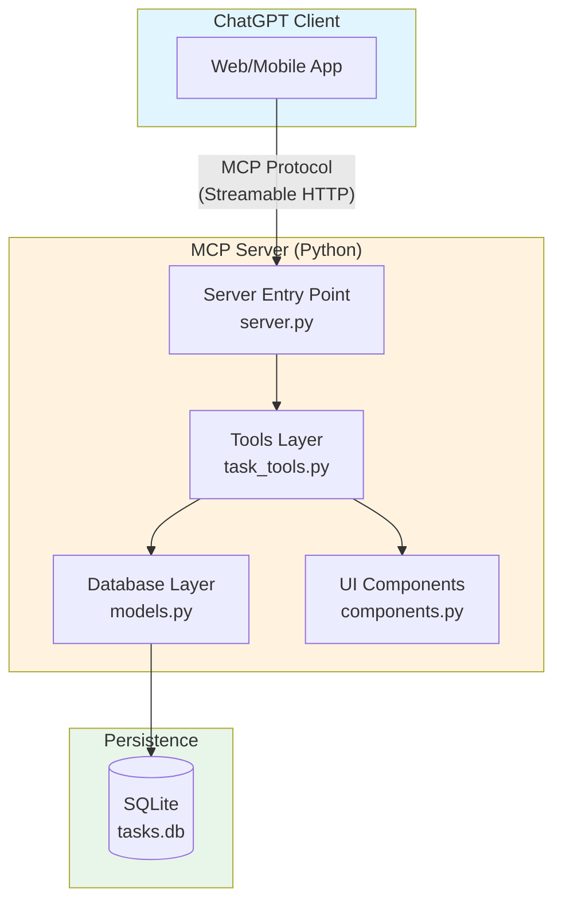
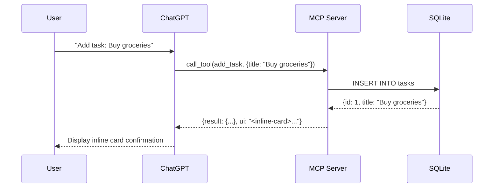
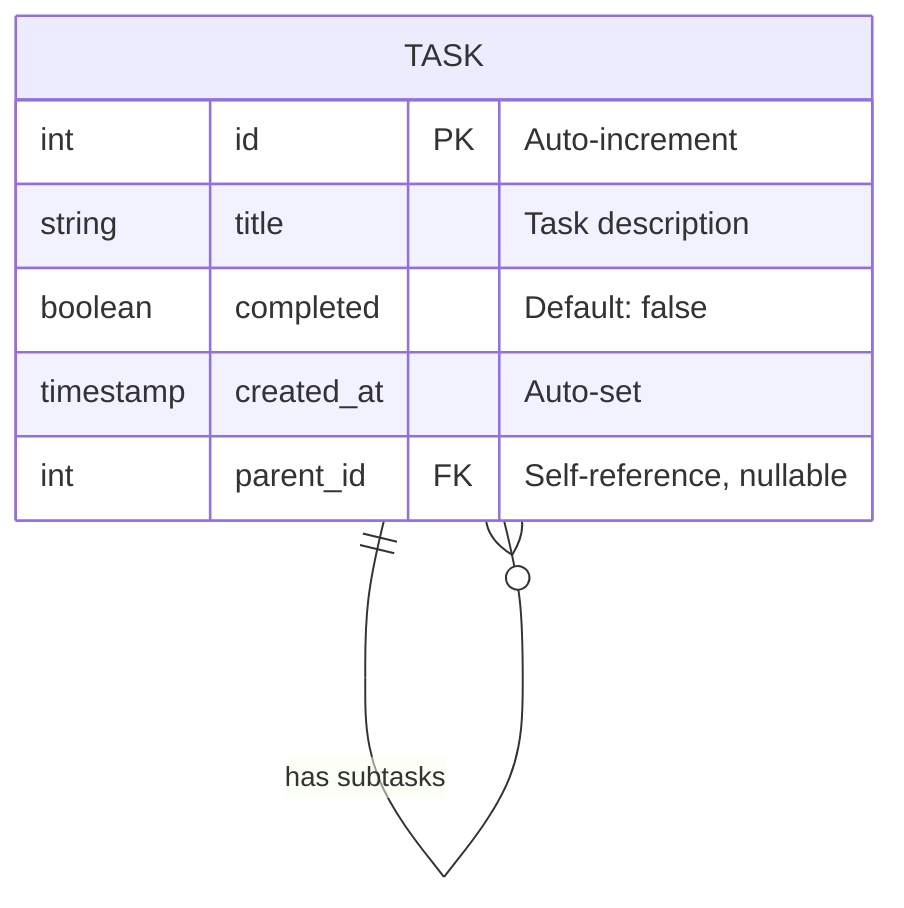
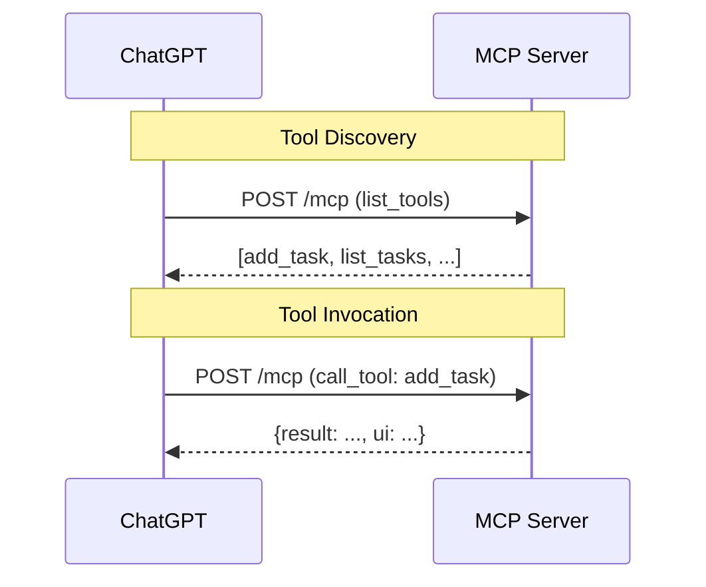
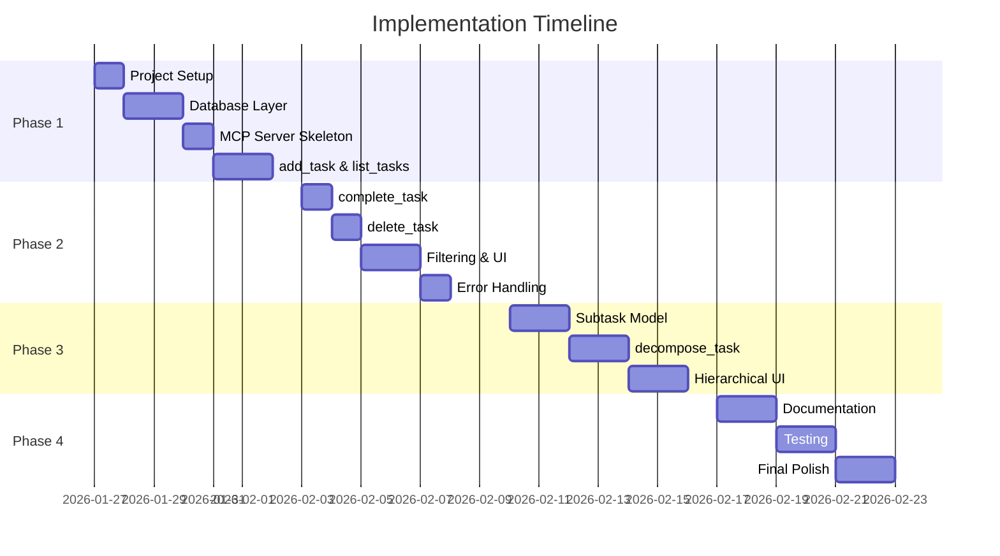

# Technical Design Document (TDD)

## ChatGPT ToDo App with AI Task Decomposition

| **Document Version** | 1.0 |
|----------------------|-----|
| **Last Updated** | January 2026 |
| **Status** | Draft |
| **Related PRD** | PRD v1.0 |

---

## 1. Technical Overview

### 1.1 System Purpose

This system implements a ChatGPT-integrated ToDo application using the OpenAI Apps SDK with MCP (Model Context Protocol). The application serves as both a functional task management tool and a reference implementation for developers learning the Apps SDK.

The system exposes task management capabilities as MCP tools that ChatGPT can invoke conversationally, enabling users to create, read, update, and delete tasks without leaving their chat interface. A key differentiator is AI-assisted task decomposition, where ChatGPT breaks complex tasks into actionable subtasks.

### 1.2 Key Technical Decisions

| Decision | Choice | Justification |
|----------|--------|---------------|
| **Protocol** | MCP over Streamable HTTP | Recommended by Apps SDK; supports bidirectional streaming for real-time UI updates |
| **Data Storage** | SQLite | Zero-configuration, file-based; ideal for single-user learning project; built into Python |
| **Server Framework** | uvicorn + MCP SDK | ASGI server provides async support; MCP SDK handles protocol compliance |
| **Data Validation** | Pydantic 2.x | Type safety, automatic JSON Schema generation for tool definitions |
| **UI Approach** | Inline Cards (HTML) | Lightweight, renders within conversation; follows Apps SDK guidelines |
| **Architecture Pattern** | Layered Architecture | Clear separation of concerns; easier to understand for learning purposes |

### 1.3 Tech Stack

| Component | Technology | Version | Justification |
|-----------|------------|---------|---------------|
| Runtime | Python | 3.10+ | Modern async support, pattern matching, type hints |
| MCP Implementation | mcp | Latest | Official Python SDK for Model Context Protocol |
| HTTP Server | uvicorn | 0.27+ | High-performance ASGI server, async-native |
| Data Validation | Pydantic | 2.x | Automatic schema generation, runtime validation |
| Database | SQLite | Built-in | Zero setup, ACID-compliant, sufficient for single-user |
| Testing | pytest | 8.x | Industry standard, excellent async support |
| Linting | ruff | Latest | Fast, comprehensive Python linter |
| Type Checking | mypy | Latest | Static type verification |

---

## 2. Architecture

### 2.1 High-Level Architecture



#### Component Responsibilities

| Component | Responsibility |
|-----------|----------------|
| **Server Entry Point** | Initialize MCP server, register tools, handle HTTP transport |
| **Tools Layer** | Define tool schemas, implement business logic, coordinate responses |
| **Database Layer** | CRUD operations, connection management, query execution |
| **UI Components** | Generate HTML for inline cards, handle display formatting |

#### Primary Data Flow



### 2.2 Component Design

#### 2.2.1 MCP Server (`server.py`)

**Responsibility:** Application entry point; initializes the MCP server, registers all tools, and manages the HTTP transport layer.

**Interfaces:**

| Interface | Type | Description |
|-----------|------|-------------|
| Input | HTTP POST | MCP protocol messages (list_tools, call_tool) |
| Output | HTTP Response | JSON-RPC responses with tool results and UI resources |

**Dependencies:**
- `mcp` SDK for protocol handling
- `uvicorn` for HTTP server
- `tools/` module for tool definitions

**Implementation Considerations:**
- Use async/await throughout for non-blocking I/O
- Configure CORS for local development
- Implement graceful shutdown handling
- Log all tool invocations for debugging

```python
# Pseudocode structure
from mcp.server import Server
from mcp.server.streamable_http import StreamableHTTPServerTransport

app = Server("todo-app")

@app.list_tools()
async def list_tools() -> list[Tool]:
    return [add_task, list_tasks, complete_task, delete_task, decompose_task]

@app.call_tool()
async def call_tool(name: str, arguments: dict) -> CallToolResult:
    handler = tool_handlers[name]
    return await handler(arguments)
```

#### 2.2.2 Tools Layer (`tools/task_tools.py`)

**Responsibility:** Define tool schemas, implement tool handlers, coordinate between database and UI layers.

**Interfaces:**

| Tool | Input Schema | Output |
|------|--------------|--------|
| `add_task` | `{title: str, parent_id?: int}` | Task object + inline card |
| `list_tasks` | `{filter?: str, parent_id?: int}` | Task array + list card |
| `complete_task` | `{task_id: int}` | Updated task + confirmation card |
| `delete_task` | `{task_id: int}` | Deletion confirmation |
| `decompose_task` | `{task_id: int, count?: int}` | Subtasks array + hierarchy card |

**Dependencies:**
- `database/models.py` for data operations
- `ui/components.py` for card generation
- `pydantic` for schema definitions

**Implementation Considerations:**
- Each tool returns both data (for ChatGPT reasoning) and UI (for user display)
- Validate all inputs before database operations
- Handle edge cases (task not found, invalid parent_id)
- `decompose_task` delegates subtask generation to ChatGPT's reasoning

#### 2.2.3 Database Layer (`database/models.py`)

**Responsibility:** Encapsulate all SQLite operations, manage connections, provide typed query results.

**Interfaces:**

```python
class TaskRepository:
    async def create(self, title: str, parent_id: int | None = None) -> Task
    async def get_all(self, filter: str = "all", parent_id: int | None = None) -> list[Task]
    async def get_by_id(self, task_id: int) -> Task | None
    async def update_completed(self, task_id: int, completed: bool) -> Task
    async def delete(self, task_id: int) -> bool
    async def create_subtasks(self, parent_id: int, titles: list[str]) -> list[Task]
```

**Dependencies:**
- `sqlite3` (built-in)
- `aiosqlite` for async operations

**Implementation Considerations:**
- Use connection pooling via context manager
- Parameterized queries to prevent SQL injection
- Cascade deletes for subtasks when parent is deleted
- Return Pydantic models for type safety

#### 2.2.4 UI Components (`ui/components.py`)

**Responsibility:** Generate HTML for inline card components following Apps SDK UI guidelines.

**Interfaces:**

```python
def render_task_card(task: Task) -> str
def render_task_list(tasks: list[Task]) -> str
def render_confirmation(message: str, task: Task | None = None) -> str
def render_task_hierarchy(parent: Task, subtasks: list[Task]) -> str
```

**Dependencies:**
- None (pure functions generating HTML strings)

**Implementation Considerations:**
- Follow Apps SDK UI Design System for colors, typography, spacing
- Support both light and dark mode via CSS variables
- Keep HTML minimal for fast rendering
- Include action buttons (complete, delete) with appropriate tool invocations

---

## 3. Data Design

### 3.1 Data Model

#### Entities

**Task**

| Attribute | Type | Constraints | Description |
|-----------|------|-------------|-------------|
| `id` | INTEGER | PRIMARY KEY, AUTO | Unique task identifier |
| `title` | TEXT | NOT NULL | Task description |
| `completed` | BOOLEAN | DEFAULT FALSE | Completion status |
| `created_at` | TIMESTAMP | DEFAULT NOW | Creation timestamp |
| `parent_id` | INTEGER | FK → tasks.id, NULLABLE | Parent task for subtasks |

#### Entity Relationship Diagram



#### Pydantic Models

```python
from pydantic import BaseModel, Field
from datetime import datetime

class TaskBase(BaseModel):
    title: str = Field(..., min_length=1, max_length=500)

class TaskCreate(TaskBase):
    parent_id: int | None = None

class Task(TaskBase):
    id: int
    completed: bool = False
    created_at: datetime
    parent_id: int | None = None
    subtasks: list["Task"] = []

    class Config:
        from_attributes = True
```

### 3.2 Storage Strategy

#### Database Selection: SQLite

**Justification:**
- Zero configuration—no server process required
- Single-file storage simplifies development and testing
- Built into Python standard library
- ACID-compliant with WAL mode for concurrent reads
- Sufficient performance for single-user task management

**File Location:** `~/.chatgpt-todo/tasks.db` (configurable via environment variable)

#### Schema DDL

```sql
-- Initial schema (v1)
CREATE TABLE IF NOT EXISTS tasks (
    id INTEGER PRIMARY KEY AUTOINCREMENT,
    title TEXT NOT NULL CHECK(length(title) > 0),
    completed BOOLEAN NOT NULL DEFAULT FALSE,
    created_at TIMESTAMP NOT NULL DEFAULT CURRENT_TIMESTAMP,
    parent_id INTEGER REFERENCES tasks(id) ON DELETE CASCADE
);

-- Index for filtering by completion status
CREATE INDEX IF NOT EXISTS idx_tasks_completed ON tasks(completed);

-- Index for parent-child queries
CREATE INDEX IF NOT EXISTS idx_tasks_parent_id ON tasks(parent_id);
```

#### Indexing Strategy

| Index | Columns | Purpose |
|-------|---------|---------|
| Primary | `id` | Auto-created, fast lookups |
| `idx_tasks_completed` | `completed` | Filter by status |
| `idx_tasks_parent_id` | `parent_id` | Subtask queries, cascade deletes |

#### Migration Considerations

For a learning project, manual migrations are sufficient:

```python
# database/migrations.py
MIGRATIONS = [
    # v1: Initial schema
    """
    CREATE TABLE IF NOT EXISTS tasks (...);
    CREATE INDEX IF NOT EXISTS idx_tasks_completed ...;
    """,
    # v2: Add due_date (future)
    # "ALTER TABLE tasks ADD COLUMN due_date TIMESTAMP;",
]

async def run_migrations(db: aiosqlite.Connection):
    # Track applied migrations in schema_version table
    ...
```

---

## 4. API Design

### 4.1 MCP Tool Definitions

The MCP server exposes tools via the standard MCP protocol. ChatGPT discovers available tools via `list_tools` and invokes them via `call_tool`.

#### Tool: `add_task`

**Description:** Create a new task or subtask

**Input Schema:**
```json
{
  "type": "object",
  "properties": {
    "title": {
      "type": "string",
      "description": "The task description",
      "minLength": 1,
      "maxLength": 500
    },
    "parent_id": {
      "type": "integer",
      "description": "Optional parent task ID for creating subtasks"
    }
  },
  "required": ["title"]
}
```

**Output:**
```json
{
  "task": {
    "id": 1,
    "title": "Buy groceries",
    "completed": false,
    "created_at": "2026-01-25T10:30:00Z",
    "parent_id": null
  },
  "ui": "<inline-card>...</inline-card>"
}
```

#### Tool: `list_tasks`

**Description:** Retrieve tasks with optional filtering

**Input Schema:**
```json
{
  "type": "object",
  "properties": {
    "filter": {
      "type": "string",
      "enum": ["all", "complete", "incomplete"],
      "default": "all",
      "description": "Filter tasks by completion status"
    },
    "parent_id": {
      "type": "integer",
      "description": "Filter to subtasks of a specific parent"
    }
  }
}
```

**Output:**
```json
{
  "tasks": [
    {
      "id": 1,
      "title": "Buy groceries",
      "completed": false,
      "created_at": "2026-01-25T10:30:00Z",
      "parent_id": null,
      "subtasks": []
    }
  ],
  "total": 1,
  "filter_applied": "all",
  "ui": "<inline-card>...</inline-card>"
}
```

#### Tool: `complete_task`

**Description:** Mark a task as completed

**Input Schema:**
```json
{
  "type": "object",
  "properties": {
    "task_id": {
      "type": "integer",
      "description": "The ID of the task to complete"
    }
  },
  "required": ["task_id"]
}
```

**Output:**
```json
{
  "task": {
    "id": 1,
    "title": "Buy groceries",
    "completed": true,
    "created_at": "2026-01-25T10:30:00Z",
    "parent_id": null
  },
  "ui": "<inline-card>...</inline-card>"
}
```

#### Tool: `delete_task`

**Description:** Remove a task and its subtasks

**Input Schema:**
```json
{
  "type": "object",
  "properties": {
    "task_id": {
      "type": "integer",
      "description": "The ID of the task to delete"
    }
  },
  "required": ["task_id"]
}
```

**Output:**
```json
{
  "deleted": true,
  "task_id": 1,
  "subtasks_deleted": 0,
  "ui": "<inline-card>...</inline-card>"
}
```

#### Tool: `decompose_task`

**Description:** Break down a complex task into subtasks (ChatGPT generates the subtasks)

**Input Schema:**
```json
{
  "type": "object",
  "properties": {
    "task_id": {
      "type": "integer",
      "description": "The ID of the task to decompose"
    },
    "subtask_titles": {
      "type": "array",
      "items": { "type": "string" },
      "minItems": 3,
      "maxItems": 10,
      "description": "Titles for the subtasks to create"
    }
  },
  "required": ["task_id", "subtask_titles"]
}
```

**Output:**
```json
{
  "parent_task": { "id": 1, "title": "Plan birthday party", ... },
  "subtasks": [
    { "id": 2, "title": "Choose venue", "parent_id": 1, ... },
    { "id": 3, "title": "Create guest list", "parent_id": 1, ... }
  ],
  "ui": "<inline-card>...</inline-card>"
}
```

### 4.2 Error Handling Strategy

#### Error Response Format

```json
{
  "error": {
    "code": "TASK_NOT_FOUND",
    "message": "Task with ID 99 does not exist",
    "details": { "task_id": 99 }
  }
}
```

#### Error Codes

| Code | HTTP Equivalent | Description |
|------|-----------------|-------------|
| `VALIDATION_ERROR` | 400 | Invalid input parameters |
| `TASK_NOT_FOUND` | 404 | Task ID doesn't exist |
| `DATABASE_ERROR` | 500 | SQLite operation failed |
| `INTERNAL_ERROR` | 500 | Unexpected server error |

#### Error Handling Implementation

```python
from enum import Enum
from pydantic import BaseModel

class ErrorCode(str, Enum):
    VALIDATION_ERROR = "VALIDATION_ERROR"
    TASK_NOT_FOUND = "TASK_NOT_FOUND"
    DATABASE_ERROR = "DATABASE_ERROR"
    INTERNAL_ERROR = "INTERNAL_ERROR"

class ToolError(BaseModel):
    code: ErrorCode
    message: str
    details: dict | None = None

async def handle_tool_call(name: str, arguments: dict) -> dict:
    try:
        return await tool_handlers[name](arguments)
    except TaskNotFoundError as e:
        return {"error": ToolError(
            code=ErrorCode.TASK_NOT_FOUND,
            message=str(e),
            details={"task_id": e.task_id}
        ).model_dump()}
    except ValidationError as e:
        return {"error": ToolError(
            code=ErrorCode.VALIDATION_ERROR,
            message="Invalid input",
            details={"errors": e.errors()}
        ).model_dump()}
    except Exception as e:
        logger.exception("Unexpected error in tool call")
        return {"error": ToolError(
            code=ErrorCode.INTERNAL_ERROR,
            message="An unexpected error occurred"
        ).model_dump()}
```

---

## 5. Integration Design

### 5.1 External Services

#### ChatGPT (via MCP Protocol)

| Aspect | Details |
|--------|---------|
| **Service** | ChatGPT Client |
| **Purpose** | Conversational interface, tool invocation, AI task decomposition |
| **Integration Method** | MCP over Streamable HTTP |
| **Connection** | ChatGPT initiates connection to MCP server |

**Protocol Flow:**



**Error Handling:**
- Connection errors: ChatGPT handles retry logic
- Tool errors: Return structured error response (see §4.2)
- Timeout: Server should respond within 2 seconds

**Rate Limiting:**
- Not implemented for learning project
- Production consideration: Add rate limiting middleware

### 5.2 Local Development Setup

For local development, the MCP server runs on localhost and ChatGPT connects via the Apps SDK development tools.

**Configuration:**

```bash
# .env
MCP_SERVER_HOST=localhost
MCP_SERVER_PORT=8000
DATABASE_PATH=~/.chatgpt-todo/tasks.db
LOG_LEVEL=DEBUG
```

**Server Startup:**

```bash
# Start MCP server
uvicorn src.server:app --host localhost --port 8000 --reload
```

---

## 6. Security Considerations

### 6.1 Authentication/Authorization

**Scope:** Not implemented for MVP (single-user local development)

**Future Consideration:** If multi-user support is added, implement:
- OAuth 2.0 flow via Apps SDK
- User ID extraction from MCP context
- Per-user task isolation

### 6.2 Data Protection

| Concern | Mitigation |
|---------|------------|
| SQL Injection | Parameterized queries exclusively |
| Data at Rest | SQLite file permissions (user-only read/write) |
| Data in Transit | HTTPS in production (localhost HTTP acceptable for dev) |

**Parameterized Query Example:**

```python
# ✅ Safe: parameterized
cursor.execute(
    "SELECT * FROM tasks WHERE id = ?", 
    (task_id,)
)

# ❌ Unsafe: string interpolation
cursor.execute(f"SELECT * FROM tasks WHERE id = {task_id}")  # NEVER DO THIS
```

### 6.3 Input Validation

All tool inputs are validated via Pydantic schemas before processing:

```python
class AddTaskInput(BaseModel):
    title: str = Field(..., min_length=1, max_length=500)
    parent_id: int | None = Field(None, ge=1)

    @field_validator('title')
    @classmethod
    def sanitize_title(cls, v: str) -> str:
        return v.strip()
```

### 6.4 Secrets Management

| Secret | Storage Method |
|--------|----------------|
| Database path | Environment variable |
| API keys (future) | Environment variable, never in code |

**Implementation:**

```python
import os
from pathlib import Path

DATABASE_PATH = Path(os.getenv(
    "DATABASE_PATH", 
    Path.home() / ".chatgpt-todo" / "tasks.db"
))
```

---

## 7. Testing Strategy

### 7.1 Unit Testing Approach

**Scope:** Individual functions and classes in isolation

**Tools:** pytest, pytest-asyncio

**Coverage Target:** 80% line coverage for `tools/` and `database/` modules

**Example:**

```python
# tests/test_tools.py
import pytest
from src.tools.task_tools import add_task_handler
from src.database.models import Task

@pytest.mark.asyncio
async def test_add_task_creates_task(mock_db):
    result = await add_task_handler({"title": "Test task"})
    
    assert "task" in result
    assert result["task"]["title"] == "Test task"
    assert result["task"]["completed"] is False
    assert "ui" in result

@pytest.mark.asyncio
async def test_add_task_with_empty_title_fails(mock_db):
    with pytest.raises(ValidationError):
        await add_task_handler({"title": ""})
```

### 7.2 Integration Testing Approach

**Scope:** Tool handlers with real SQLite database

**Setup:** Use in-memory SQLite (`:memory:`) for fast, isolated tests

```python
# tests/conftest.py
import pytest
import aiosqlite
from src.database.connection import init_db

@pytest.fixture
async def test_db():
    """Create an in-memory database for testing."""
    async with aiosqlite.connect(":memory:") as db:
        await init_db(db)
        yield db
```

### 7.3 Mocking Strategy

| Component | Mock Strategy |
|-----------|---------------|
| SQLite | In-memory database for integration tests |
| MCP Protocol | Mock request/response objects |
| UI Components | Snapshot testing for HTML output |

**UI Snapshot Testing:**

```python
# tests/test_ui.py
def test_task_card_renders_correctly(snapshot):
    task = Task(id=1, title="Buy groceries", completed=False, ...)
    html = render_task_card(task)
    
    assert html == snapshot  # Compare against saved snapshot
```

### 7.4 Test Organization

```
tests/
├── conftest.py           # Shared fixtures
├── unit/
│   ├── test_models.py    # Pydantic model tests
│   └── test_schemas.py   # JSON Schema generation tests
├── integration/
│   ├── test_tools.py     # Tool handler tests with DB
│   └── test_database.py  # Repository tests
└── e2e/
    └── test_mcp_flow.py  # Full MCP request/response cycle
```

---

## 8. Implementation Plan

### 8.1 Implementation Phases

#### Phase 1: Foundation (Week 1)

| Task | Description | Deliverable |
|------|-------------|-------------|
| 1.1 | Project setup | `pyproject.toml`, directory structure, dev dependencies |
| 1.2 | Database layer | SQLite connection, schema creation, Task model |
| 1.3 | MCP server skeleton | Basic server with uvicorn, health check endpoint |
| 1.4 | `add_task` tool | Schema, handler, basic inline card |
| 1.5 | `list_tasks` tool | Schema, handler, list display |

**Milestone:** Can add tasks via MCP and see them listed

#### Phase 2: Core CRUD (Week 2)

| Task | Description | Deliverable |
|------|-------------|-------------|
| 2.1 | `complete_task` tool | Toggle completion status |
| 2.2 | `delete_task` tool | Remove task with confirmation |
| 2.3 | Task filtering | Filter by complete/incomplete |
| 2.4 | Improved UI cards | Action buttons, status indicators |
| 2.5 | Error handling | Structured error responses |

**Milestone:** Full CRUD operations working with polished UI

#### Phase 3: AI Features (Week 3)

| Task | Description | Deliverable |
|------|-------------|-------------|
| 3.1 | Subtask data model | `parent_id` implementation, cascade delete |
| 3.2 | `decompose_task` tool | Accept subtask titles, create hierarchy |
| 3.3 | Hierarchical display | Render parent/child relationships |
| 3.4 | Subtask operations | Complete/delete individual subtasks |

**Milestone:** Task decomposition working end-to-end

#### Phase 4: Polish (Week 4)

| Task | Description | Deliverable |
|------|-------------|-------------|
| 4.1 | Documentation | README, inline comments, docstrings |
| 4.2 | Testing | Unit tests, integration tests |
| 4.3 | Code cleanup | Linting, type checking, refactoring |
| 4.4 | Edge cases | Empty states, error messages |
| 4.5 | Final review | Manual testing, documentation review |

**Milestone:** Production-ready codebase with comprehensive documentation

### 8.2 Milestones



### 8.3 Technical Risks

| Risk | Probability | Impact | Mitigation |
|------|-------------|--------|------------|
| Apps SDK API changes during development | Medium | High | Pin SDK version, monitor changelog |
| MCP protocol complexity | Low | Medium | Follow official examples closely |
| Async SQLite issues | Low | Medium | Use well-tested `aiosqlite` library |
| Inline card rendering issues | Medium | Medium | Test early with ChatGPT, iterate on UI |
| Local development environment setup | Medium | Low | Document setup thoroughly, provide troubleshooting guide |

---

## 9. Architectural Decision Records (ADRs)

### ADR-001: Use Streamable HTTP Transport

**Context:**  
The MCP specification supports multiple transport protocols: stdio, Streamable HTTP, and SSE (deprecated). We need to choose the appropriate transport for integrating with ChatGPT via the Apps SDK.

**Decision:**  
Use Streamable HTTP transport for the MCP server.

**Consequences:**
- ✅ Recommended by Apps SDK documentation
- ✅ Supports bidirectional communication for real-time UI updates
- ✅ Works with standard HTTP infrastructure
- ✅ Easy to debug with standard HTTP tools
- ❌ Slightly more complex than stdio (requires HTTP server)

**Alternatives Considered:**
- **stdio:** Simpler but not supported by ChatGPT client
- **SSE:** Deprecated in favor of Streamable HTTP

---

### ADR-002: SQLite for Data Persistence

**Context:**  
The application needs to persist tasks across sessions. Options include SQLite, JSON files, PostgreSQL, or cloud databases.

**Decision:**  
Use SQLite for local data persistence.

**Consequences:**
- ✅ Zero configuration—no database server to manage
- ✅ Built into Python standard library
- ✅ ACID-compliant, handles concurrent reads well
- ✅ Single file simplifies backup and portability
- ✅ Sufficient performance for single-user workload
- ❌ Not suitable for multi-user without significant changes
- ❌ Limited concurrent write performance

**Alternatives Considered:**
- **JSON file:** No query capability, manual indexing required
- **PostgreSQL:** Overkill for learning project, requires server setup
- **Cloud DB (e.g., Supabase):** Adds complexity, requires internet

---

### ADR-003: Pydantic for Data Validation and Schemas

**Context:**  
MCP tools require JSON Schema definitions for input validation. We need a robust way to define schemas and validate runtime data.

**Decision:**  
Use Pydantic 2.x for data models and automatic JSON Schema generation.

**Consequences:**
- ✅ Single source of truth for models and schemas
- ✅ Runtime validation with clear error messages
- ✅ Automatic JSON Schema generation via `.model_json_schema()`
- ✅ Excellent IDE support and type hints
- ✅ Industry standard for Python APIs
- ❌ Additional dependency (though widely used)

**Alternatives Considered:**
- **dataclasses + manual schemas:** More boilerplate, schema drift risk
- **marshmallow:** Less ergonomic than Pydantic 2.x
- **attrs:** Good, but Pydantic has better JSON Schema support

---

### ADR-004: Layered Architecture Pattern

**Context:**  
The codebase needs a clear structure that separates concerns and is easy for learning developers to understand.

**Decision:**  
Implement a layered architecture with distinct layers for tools, database, and UI.

**Consequences:**
- ✅ Clear separation of concerns
- ✅ Each layer can be tested independently
- ✅ Easy to understand for developers learning the SDK
- ✅ Facilitates future modifications
- ❌ May feel over-engineered for a small app
- ❌ Some indirection between layers

**Alternatives Considered:**
- **Single module:** Simpler but harder to maintain and test
- **Hexagonal architecture:** Too complex for learning project
- **Feature-based structure:** Less intuitive for SDK learning

---

### ADR-005: Inline Cards for UI Components

**Context:**  
The Apps SDK supports multiple UI paradigms: inline cards, carousels, and fullscreen views. We need to choose the primary UI approach.

**Decision:**  
Use inline cards as the primary UI component, with lists for multiple tasks.

**Consequences:**
- ✅ Lightweight, renders within conversation flow
- ✅ Follows Apps SDK UI guidelines
- ✅ Sufficient for MVP task management
- ✅ Simplest implementation path
- ❌ Limited space for complex hierarchies
- ❌ May need fullscreen view for 10+ tasks (future enhancement)

**Alternatives Considered:**
- **Fullscreen view only:** Disrupts conversation flow
- **Text-only responses:** Poor UX for task management
- **Carousel:** Good for many tasks, but adds complexity

---

### ADR-006: ChatGPT Handles Subtask Generation

**Context:**  
The `decompose_task` feature needs to generate contextually relevant subtasks. We could implement this in the MCP server or leverage ChatGPT's reasoning.

**Decision:**  
ChatGPT generates subtask titles; the MCP server only persists them.

**Consequences:**
- ✅ Leverages ChatGPT's superior language understanding
- ✅ Contextual subtasks based on conversation history
- ✅ Simpler MCP server implementation
- ✅ No additional AI API costs (uses existing ChatGPT session)
- ❌ Less control over subtask quality
- ❌ Requires clear tool description for consistent results

**Implementation:**
The `decompose_task` tool accepts an array of subtask titles generated by ChatGPT:

```
User: "Break down 'Plan birthday party' into subtasks"
ChatGPT: [reasons about subtasks, then calls tool]
→ call_tool(decompose_task, {
    task_id: 1, 
    subtask_titles: ["Choose venue", "Create guest list", "Order cake", ...]
  })
```

**Alternatives Considered:**
- **MCP server calls OpenAI API:** Additional complexity, API costs, latency
- **Hardcoded subtask templates:** Inflexible, poor UX

---

## 10. Appendix

### A. File Structure Reference

```
chatgpt-todo-app/
├── docs/
│   ├── PRD.md                    # Product requirements
│   ├── TDD.md                    # This document
│   └── ADRs/
│       ├── ADR-001-transport.md
│       ├── ADR-002-database.md
│       └── ...
├── src/
│   ├── __init__.py
│   ├── server.py                 # MCP server entry point
│   ├── config.py                 # Configuration management
│   ├── tools/
│   │   ├── __init__.py
│   │   ├── task_tools.py         # Tool handlers
│   │   └── schemas.py            # Pydantic schemas
│   ├── database/
│   │   ├── __init__.py
│   │   ├── connection.py         # SQLite connection management
│   │   └── models.py             # Task repository
│   └── ui/
│       ├── __init__.py
│       └── components.py         # HTML card generators
├── tests/
│   ├── conftest.py               # Shared fixtures
│   ├── unit/
│   │   └── ...
│   └── integration/
│       └── ...
├── .env.example                  # Environment variable template
├── .gitignore
├── CLAUDE.md                     # AI assistant context
├── README.md                     # Setup and usage instructions
├── pyproject.toml                # Project configuration
└── requirements.txt              # Dependencies (generated)
```

### B. Environment Variables

| Variable | Required | Default | Description |
|----------|----------|---------|-------------|
| `DATABASE_PATH` | No | `~/.chatgpt-todo/tasks.db` | SQLite database file path |
| `MCP_SERVER_HOST` | No | `localhost` | Server bind host |
| `MCP_SERVER_PORT` | No | `8000` | Server bind port |
| `LOG_LEVEL` | No | `INFO` | Logging verbosity |

### C. Useful Commands

```bash
# Development
uvicorn src.server:app --reload          # Start dev server
pytest                                    # Run tests
pytest --cov=src                          # Run with coverage
ruff check src/                           # Lint code
mypy src/                                 # Type check

# Database
sqlite3 ~/.chatgpt-todo/tasks.db          # Open database CLI
sqlite3 ~/.chatgpt-todo/tasks.db ".schema" # View schema
```

### D. Reference Links

| Resource | URL |
|----------|-----|
| OpenAI Apps SDK | https://developers.openai.com/apps-sdk/ |
| MCP Specification | https://modelcontextprotocol.io/specification |
| Python MCP SDK | https://github.com/modelcontextprotocol/python-sdk |
| Apps SDK UI Guidelines | https://developers.openai.com/apps-sdk/concepts/ui-guidelines |
| Pydantic Documentation | https://docs.pydantic.dev/ |
| uvicorn Documentation | https://www.uvicorn.org/ |

---

*Document prepared for learning purposes. Not intended for production deployment.*
